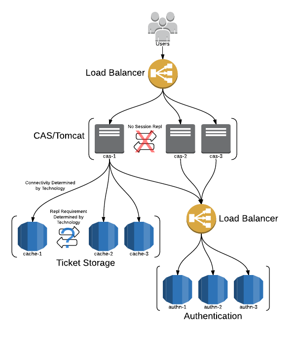

# High Availability Guide (HA/Clustering)

A highly available CAS deployment is one that offers resilience in response to various failure modes such that CAS
continues to offer SSO services despite failures. We offer a recommended architecture that provides a starting point
for planning and executing a CAS deployment that meets institutional performance and availability requirements.
It also provides a framework for understanding CAS software component requirements imposed by HA considerations.

## Recommended Architecture
The following diagram highlights the vital aspects of a highly available CAS deployment.

It's worth pointing out some important characteristics of this architecture:

* Dependent systems can tolerate up to N-1 node failures. (Where N is the total number of nodes.)
* CAS itself can tolerate up to N-1 node failures.
* Loss of a cache node DOES NOT cause loss of SSO state data (i.e. tickets) in replicating caches.
* Loss of a cache node MAY cause loss of SSO state data in non-replicating caches (e.g. memcached).
* Loss of SSO state data is always graceful: users simply reauthenticate.

Before proceeding into a detailed discussion of various aspects of the recommended architecture, we offer a guiding
principle for planning a highly available deployment:

*Design the simplest solution that meets performance and availability requirements.*

Experience has shown that simplicity is a vital system characteristic of successful and robust HA deployments.
Strive for simplicity and you will be well served.

### Multiple CAS Server Nodes
A highly available CAS deployment is composed of two or more nodes behind a hardware load balancer in either
active/passive or active/active mode. In general the former offers simplicity with adequate failover;
the latter, improved resource usage and reduced service interruptions at the cost of additional complexity.

#### Active/Passive Mode
In an active/passive load balanced configuration, 1 of N nodes serves all requests at any given time. This simplifies
ticket storage requirements since it is not necessary to share ticket state among several application nodes.
In particular, the `DefaultTicketRegistry` component that stores tickets in memory is suitable for active/failover
setups with the understanding that a node failure would result in ticket loss. It's worth repeating that ticket loss
results in graceful application failure where users simply reauthenticate to CAS to create new SSO sessions;
CAS client sessions created under prevous SSO sessions would suffer no iterruption or loss of data.

#### Active/Active Mode
A load balancer in active/active mode serves requests to all N nodes similutaneously. The load balancer chooses a node
to serve a request based on a configured algorithm; typically least active or round robin. In this system architecture,
it is vitally important to use a ticket store where a ticket can be located regardless of which CAS node requests it.

It's instructive to discuss the origin of this requirement. There are two interactions for tickets that occur from
fundamentally different network sources:

1. User's Web browser contacts CAS to generate a ticket.
2. Target service contacts CAS with a ticket to validate it.

Since both requests flow through the load balancer from different source addresses, it is not possible to guarantee
that both requests are serviced by the same CAS node. Thus the requirement that a ticket be locatable regardless of
the CAS node that requests it. It should be clear why in-memory storage is not suitable for active/active deployments.

There is a further consideration for active/active deployments: session affinity. Session affinity is a feature of
most load balancer equipment where the device performs state management for incoming requests and routes a client to
the same node for subsequent requests for a period of time. This feature is recommended and required to avoid servlet
container session replication, which is generally more complex and less reliable. The core of this requirement is that
servlet container session storage is used to maintain state for the CAS login and logout Webflows.
While it is possible to achieve truly stateless active/active deployments by plugging in
[client-based state management](https://github.com/serac/spring-webflow-client-repo) components, such configurations
at present have not been proven and are not recommended without careful planning and testing.

#### Avoid Round Robin DNS
We _strongly_ recommend avoiding round robin DNS as a cost-effective alternative to a hardware load balancer.
Client cache expiration policy is entirely uncontrollable, and typical cache expiration times are much longer than
desirable periods for node failover. A [reverse proxy](http://httpd.apache.org/docs/current/mod/mod_proxy.html) or
[software load balancer](http://www.linuxvirtualserver.org/software/ipvs.html) are recommended alternatives to hardware.

### Cache-Based Ticket Registry
The following cache-based ticket storage components provide the best tradeoff among ease of use, scalability, and
fault tolerance and are suitable for both active/passive and active/active setups:

* [EhCacheTicketRegistry](../installation/Ehcache-Ticket-Registry.html)
* [JBossTicketRegistry](../installation/JBoss-Cache-Ticket-Registry.html)
* [MemCacheTicketRegistry](../installation/Memcached-Ticket-Registry.html)

The particular choice of caching technology should be driven by infrastructure and expertise as much as performance
and availability considerations. It's hardly valuable to have a high-performance cache for which you lack the
expertise to troubleshoot when problems invariably arise.

The technology considerations of the various cache components merit some discussion since there are notable
differences that impact availability and performance characteristics. Cache systems like Ehcache and JBoss Cache
(and its offspring, Infinispan) offer a distributed cache that presents a single, consistent view of entries regardless
of the node contacted. Distributed caches rely on replication to provide for consistency. Cache systems like memcached
store the ticket on exactly 1 node and use a deterministic algorithm to locate the node containing the ticket:

    N' = f(h(T), N1, N2, N3, ... Nm)

where _h(T)_ is the hash of the ticket ID, _N1 ... Nm_ is the set of cache nodes, and _N'_ ∈ _N ... Nm_.

These sorts of cache systems do not require replication and generally provide for simplicity at the expense of some
durability.

### Connection Pooling
We _strongly_ recommend that all IO connections to a back-end data stores, such as LDAP directories and databases,
leverage connection pooling where possible. It makes the best use of computational (especially for SSL/TLS connections)
and IO resources while providing the best performance characteristics.
